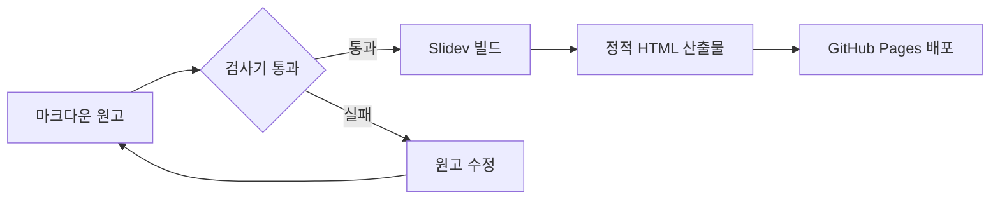

# 마크다운으로 쓰는 HTML 슬라이드

Slidev 가 실제로 무엇을 해 주는지 세 장으로 확인합니다

<div class="pt-8 opacity-70 text-sm">
  방향키 → 를 누르면 다음으로 넘어갑니다
</div>

---

# 첫째 장 — 마크다운만 사용한 슬라이드

이 장에는 Vue 컴포넌트도, 별도의 지시자도 없습니다. 평범한 마크다운 문법만으로 작성했습니다.

- 제목은 `#` 으로 쓰고, 슬라이드는 `---` 로 구분합니다.
- **굵게**, *기울임*, `인라인 코드` 가 그대로 렌더됩니다.
- 코드 블록에는 구문 강조가 자동으로 붙습니다.

```ts
export function greet(name: string): string {
  return `안녕하세요, ${name} 님`
}
```

> 인용문도 마크다운 그대로 동작합니다.

---
layout: default
---

# 둘째 장 — 카드 여섯 개가 하나씩 등장합니다

방향키 → 를 여섯 번 누르면 카드가 순서대로 하나씩 나타납니다.

<div class="grid grid-cols-3 gap-4 pt-6">
  <div v-click class="p-4 rounded-lg border border-teal-500 bg-teal-500 bg-opacity-10">
    <div class="text-3xl font-bold text-teal-400">1</div>
    <div class="mt-2 text-sm">요구사항 정의</div>
  </div>
  <div v-click class="p-4 rounded-lg border border-teal-500 bg-teal-500 bg-opacity-10">
    <div class="text-3xl font-bold text-teal-400">2</div>
    <div class="mt-2 text-sm">설계 문서 작성</div>
  </div>
  <div v-click class="p-4 rounded-lg border border-teal-500 bg-teal-500 bg-opacity-10">
    <div class="text-3xl font-bold text-teal-400">3</div>
    <div class="mt-2 text-sm">검사기 구축</div>
  </div>
  <div v-click class="p-4 rounded-lg border border-teal-500 bg-teal-500 bg-opacity-10">
    <div class="text-3xl font-bold text-teal-400">4</div>
    <div class="mt-2 text-sm">구현과 리뷰</div>
  </div>
  <div v-click class="p-4 rounded-lg border border-teal-500 bg-teal-500 bg-opacity-10">
    <div class="text-3xl font-bold text-teal-400">5</div>
    <div class="mt-2 text-sm">뮤테이션 검증</div>
  </div>
  <div v-click class="p-4 rounded-lg border border-teal-500 bg-teal-500 bg-opacity-10">
    <div class="text-3xl font-bold text-teal-400">6</div>
    <div class="mt-2 text-sm">배포와 기록</div>
  </div>
</div>

<div v-click class="pt-8 text-sm opacity-70">
  등장 순서는 <code>v-click</code> 이 붙은 차례를 그대로 따릅니다.
</div>

---

# 셋째 장 — Mermaid flowchart

코드 블록의 언어를 `mermaid` 로 지정하면 도식이 그려집니다.



원고와 도식이 같은 파일 안에 있으므로, 도식만 따로 관리하지 않아도 됩니다.
